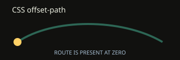
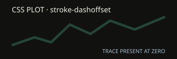
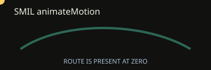
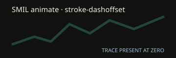
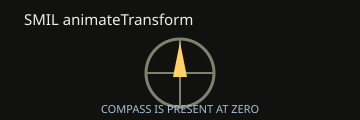

# commitatlas-motion-probes
Synthetic SVG motion compatibility probes for CommitAtlas issue #113

These fixtures are synthetic-only and do not include private data, tokens, or runtime outputs.

## Fixture links
- [Index](tests/fixtures/motion-probes/index.html)
- [css-breathe](tests/fixtures/motion-probes/css-breathe.svg)
- [css-enter](tests/fixtures/motion-probes/css-enter.svg)
- [css-from-state-control](tests/fixtures/motion-probes/css-from-state-control.svg)
- [css-offset-path](tests/fixtures/motion-probes/css-offset-path.svg)
- [css-plot](tests/fixtures/motion-probes/css-plot.svg)
- [smil-animate-motion](tests/fixtures/motion-probes/smil-animate-motion.svg)
- [smil-plot](tests/fixtures/motion-probes/smil-plot.svg)
- [smil-transform](tests/fixtures/motion-probes/smil-transform.svg)
- [reduced-motion-control](tests/fixtures/motion-probes/reduced-motion-control.svg)

## Probe embeds

## Raw probe picture delivery

<picture>
  <source media="(prefers-reduced-motion: reduce)" srcset="tests/fixtures/motion-probes/reduced-motion-control.svg">
  <source media="(prefers-color-scheme: dark)" srcset="tests/fixtures/motion-probes/css-breathe.svg">
  
</picture>
<picture>
  <source media="(prefers-reduced-motion: reduce)" srcset="tests/fixtures/motion-probes/reduced-motion-control.svg">
  <source media="(prefers-color-scheme: dark)" srcset="tests/fixtures/motion-probes/css-enter.svg">
  
</picture>
<picture>
  <source media="(prefers-reduced-motion: reduce)" srcset="tests/fixtures/motion-probes/reduced-motion-control.svg">
  <source media="(prefers-color-scheme: dark)" srcset="tests/fixtures/motion-probes/css-from-state-control.svg">
  
</picture>
<picture>
  <source media="(prefers-reduced-motion: reduce)" srcset="tests/fixtures/motion-probes/reduced-motion-control.svg">
  <source media="(prefers-color-scheme: dark)" srcset="tests/fixtures/motion-probes/css-offset-path.svg">
  
</picture>
<picture>
  <source media="(prefers-reduced-motion: reduce)" srcset="tests/fixtures/motion-probes/reduced-motion-control.svg">
  <source media="(prefers-color-scheme: dark)" srcset="tests/fixtures/motion-probes/css-plot.svg">
  
</picture>
<picture>
  <source media="(prefers-reduced-motion: reduce)" srcset="tests/fixtures/motion-probes/reduced-motion-control.svg">
  <source media="(prefers-color-scheme: dark)" srcset="tests/fixtures/motion-probes/smil-animate-motion.svg">
  
</picture>
<picture>
  <source media="(prefers-reduced-motion: reduce)" srcset="tests/fixtures/motion-probes/reduced-motion-control.svg">
  <source media="(prefers-color-scheme: dark)" srcset="tests/fixtures/motion-probes/smil-plot.svg">
  
</picture>
<picture>
  <source media="(prefers-reduced-motion: reduce)" srcset="tests/fixtures/motion-probes/reduced-motion-control.svg">
  <source media="(prefers-color-scheme: dark)" srcset="tests/fixtures/motion-probes/smil-transform.svg">
  
</picture>

## Worker/Camo probe embeds

These are fixed synthetic assets from CommitAtlas issue #174.

<picture>
  <source media="(prefers-reduced-motion: reduce)" srcset="https://commit-atlas.commit-atlas.workers.dev/api/v1/probes/motion/reduced-motion-control.svg">
  <source media="(prefers-color-scheme: dark)" srcset="https://commit-atlas.commit-atlas.workers.dev/api/v1/probes/motion/css-breathe.svg">
  
</picture>
<picture>
  <source media="(prefers-reduced-motion: reduce)" srcset="https://commit-atlas.commit-atlas.workers.dev/api/v1/probes/motion/reduced-motion-control.svg">
  <source media="(prefers-color-scheme: dark)" srcset="https://commit-atlas.commit-atlas.workers.dev/api/v1/probes/motion/css-enter.svg">
  
</picture>
<picture>
  <source media="(prefers-reduced-motion: reduce)" srcset="https://commit-atlas.commit-atlas.workers.dev/api/v1/probes/motion/reduced-motion-control.svg">
  <source media="(prefers-color-scheme: dark)" srcset="https://commit-atlas.commit-atlas.workers.dev/api/v1/probes/motion/css-from-state-control.svg">
  
</picture>
<picture>
  <source media="(prefers-reduced-motion: reduce)" srcset="https://commit-atlas.commit-atlas.workers.dev/api/v1/probes/motion/reduced-motion-control.svg">
  <source media="(prefers-color-scheme: dark)" srcset="https://commit-atlas.commit-atlas.workers.dev/api/v1/probes/motion/css-offset-path.svg">
  
</picture>
<picture>
  <source media="(prefers-reduced-motion: reduce)" srcset="https://commit-atlas.commit-atlas.workers.dev/api/v1/probes/motion/reduced-motion-control.svg">
  <source media="(prefers-color-scheme: dark)" srcset="https://commit-atlas.commit-atlas.workers.dev/api/v1/probes/motion/css-plot.svg">
  
</picture>
<picture>
  <source media="(prefers-reduced-motion: reduce)" srcset="https://commit-atlas.commit-atlas.workers.dev/api/v1/probes/motion/reduced-motion-control.svg">
  <source media="(prefers-color-scheme: dark)" srcset="https://commit-atlas.commit-atlas.workers.dev/api/v1/probes/motion/smil-animate-motion.svg">
  
</picture>
<picture>
  <source media="(prefers-reduced-motion: reduce)" srcset="https://commit-atlas.commit-atlas.workers.dev/api/v1/probes/motion/reduced-motion-control.svg">
  <source media="(prefers-color-scheme: dark)" srcset="https://commit-atlas.commit-atlas.workers.dev/api/v1/probes/motion/smil-plot.svg">
  
</picture>
<picture>
  <source media="(prefers-reduced-motion: reduce)" srcset="https://commit-atlas.commit-atlas.workers.dev/api/v1/probes/motion/reduced-motion-control.svg">
  <source media="(prefers-color-scheme: dark)" srcset="https://commit-atlas.commit-atlas.workers.dev/api/v1/probes/motion/smil-transform.svg">
  
</picture>

